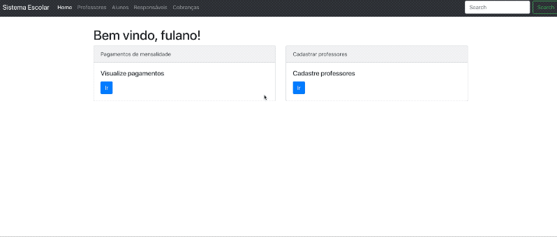

# Sistema de Acompanhamento Escolar - Grupo 8

### Descrição do projeto
Este projeto tem como objetivo o desenvolvimento de um sistema que possibilita a comunicação entre professores, alunos e pais dos alunos em escolas do ensino médio e fundamental. Os pais também poderão acompanhar mais de perto o rendimento dos filhos tais como as notas e as presenças em sala de aula.

### Membros
  - Joao Henrique Gonçalves Veras (jhgv)
  - Rielson Leandro Silva de Lima (rlsl)

### Artefatos
* Entrega 1 - Análise e Projeto de Sistemas - Documento de análise de requisitos da primeira entrega.
* Apresentação 1.pdf - Apresentação da primeira entrega (RUP)
* Apresentação 2.pdf - awesome web-based text editor (SOA)
* diagramas.asta - Arquivo do programa Astah com os diagra
* [codigo_rup] - Código fonte da primeira entrega.
* [codigo_soa] - Código fonte da primeira entrega.


### Como rodar projeto microserviço

É necessário estar com o Docker Engine rodando. A primeira fez que o comando for executado, vai demorar um pouco.

```sh
$ cd codigo_soa
$ docker-compose up --build
```

Ir para https://localhost:9995/home

GIF demonstrativo da operação de cadastrar professor:



   [codigo_soa]: <https://github.com/jhgv/if718-grupo8/tree/master/codigo_soa>
   [codigo_rup]: <https://github.com/jhgv/if718-grupo8/tree/master/codigo_rup>

   [PlDb]: <https://github.com/joemccann/dillinger/tree/master/plugins/dropbox/README.md>
   [PlGh]: <https://github.com/joemccann/dillinger/tree/master/plugins/github/README.md>
   [PlGd]: <https://github.com/joemccann/dillinger/tree/master/plugins/googledrive/README.md>
   [PlOd]: <https://github.com/joemccann/dillinger/tree/master/plugins/onedrive/README.md>
   [PlMe]: <https://github.com/joemccann/dillinger/tree/master/plugins/medium/README.md>
   [PlGa]: <https://github.com/RahulHP/dillinger/blob/master/plugins/googleanalytics/README.md>
